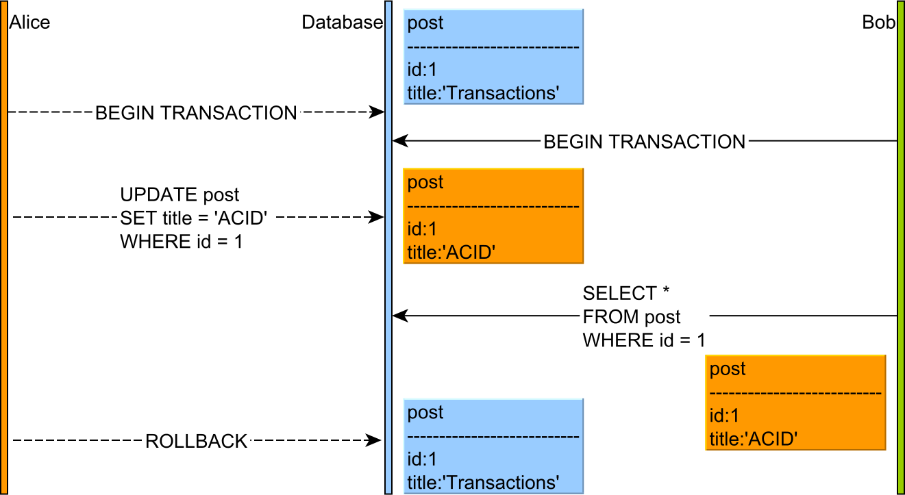

# Isolation

## Dirty read

A `dirty read` is a reading issue that occurs when `uncommitted` data is read from the database.

Suppose transaction 1 wrote the last row in the database but did not commit it yet. At the same time, transaction 2 accesses the same resource and reads data from the table.

Since transaction 1 did not commit the changes it made yet, it will try to read `uncommitted` data. This is a problem, as if transaction 1 fails, the data may be `rolled back`, changing the values. This would lead to transaction 2 reading wrong values.

| ID    | Name    | Balance    |
|---------------- | --------------- | --------------- |
| 1    | John    | 10000    |
| 2    | David    | 200    |

| Flow    | Transaction 1 (T1)    | Transaction 2 (T2)    | Explanation    |
|---------------- | --------------- | --------------- | --------------- |
| Step 1    | Begin T1;                                             |             | T1 start.    |
| Step 2    |                                                       | Begin T2;   | T2 start.   |
| Step 3    | `Update` bank `set` balance = balance - 100 `where` id = 1; |    | T1 update balance of John.   |
| Step 4    |    | `Select` balance `where` id = 1;   `result: 9900`   | T2 read balance of John before T1 commit/rollback `Dirty read occurs.`   |
| Step 5    |    | `commit`; |    T2 commits   |
| Step 5    | `commit`; |  |    T1 commits   |

In the diagram above, the flow of statements goes like this:

1. Alice and Bob start two database transactions.
2. Alice modifies the title of a given post record.
3. Bob reads the uncommitted post record.
4. If Alice commits her transaction, everything is fine. But if Alice rolls back, then Bob will see a record version that no longer exists in the database transaction log.

This anomaly is only permitted by the Read Uncommitted isolation level, and, because of the impact on data integrity, most database systems offer a higher default isolation level.

## Non-repeatable read

| ID   | name    |
|--------------- | --------------- |
| 1   | John   |
| 2   | David   |

| Flow    | Transaction 1 (T1)    | Transaction 2 (T2)    | Explanation    |
|---------------- | --------------- | --------------- | --------------- |
| Step 1    | `BEGIN;`    |     | T1 starts.    |
| Step 2    |    | `BEGIN;`   | T2 starts.   |
| Step 3   | `SELECT` * `FROM` person `WHERE` id = 2; `result: 2 David`  |    | T1 reads `Davids`   |
| Step 4   |    | `UPDATE` person `SET` name = 'Tom' `WHERE` id = 2;   | T2 updates `David` to `Tom`.   |
| Step 5   |    | `COMMIT;`   | T2 commits. |
| Step 6   | `SELECT` * `FROM` person `WHERE` id = 2; `result: 2 Tom`   | | T1 read `Tom` instead of `David` after T2 commits. `Non-repeatable read occurs!`   |
| Step 7   |  `COMMIT;`  | | T1 commits. |

## Phantom read

| ID   | name    |
|--------------- | --------------- |
| 1   | John   |
| 2   | David   |

| Flow    | Transaction 1 (T1)    | Transaction 2 (T2)    | Explanation    |
|---------------- | --------------- | --------------- | --------------- |
| Step 1    | `BEGIN;`    |     | T1 starts.    |
| Step 2    |    | `BEGIN;`   | T2 starts.   |
| Step 3   | `SELECT` * `FROM` person; `result: 1 John\ 2 David`  |    | T1 reads 2 rows.   |
| Step 4   |    | `INSERT INTO` person `VALUES` (3, 'Tom');   | T2 inserts the row with `3` and `Tom` to `person` table.   |
| Step 5   |    | `COMMIT;`   | T2 commits. |
| Step 6   | `SELECT` * `FROM` person ; `result: 1 John\ 2 David\ 2 Tom`   | | T1 reads 3 rows instead of 2 rows after T2 commits. `Phantom read occurs!`   |
| Step 7   |  `COMMIT;`  | | T1 commits. |

