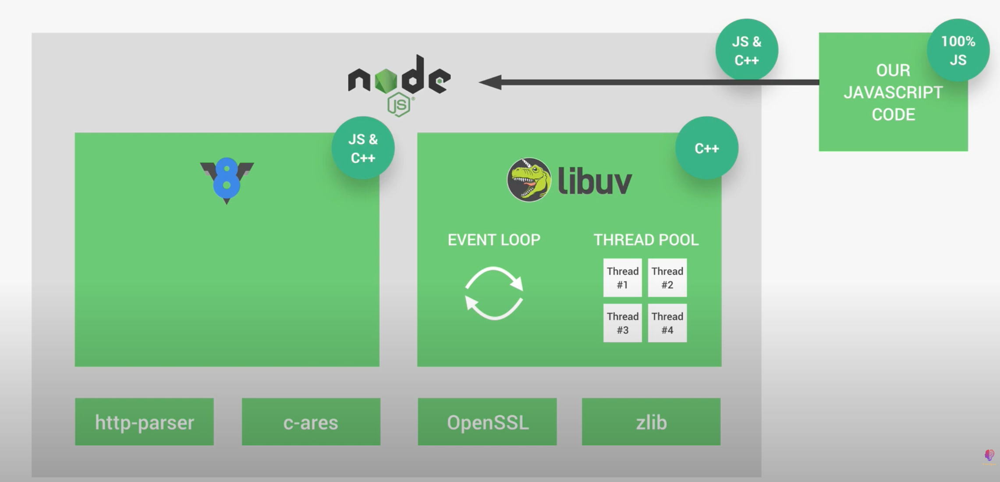
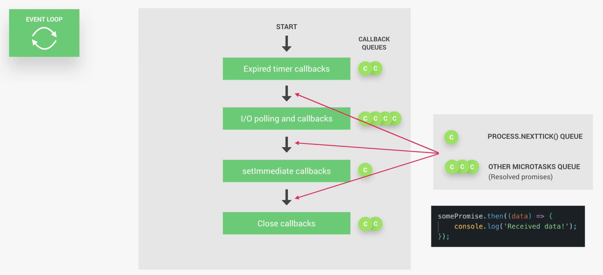
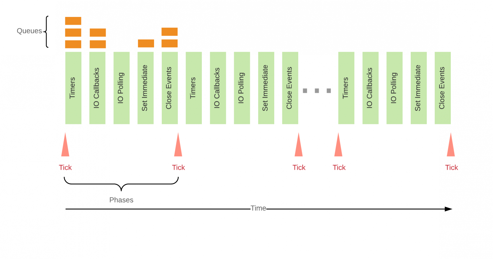

# Deep Nodejs

# Nodejs Architecture behind the scense



- `Node` là một `javascript runtime` dựa trên `Google V8 engine`.
- `V8 engine` convert javascript code to machine code để computer có thể hiểu. Nhưng chỉ vậy là không đủ
  bên cạnh đó là `libuv`. `Libuv` là một open source library mạnh mẽ trọng tâm vào `asynchronous I/O`, nó giúp node
  giao tiếp với `OS`.
- `Libuv` triển khai `Event loop`, chịu trách nhiệm cho cơ chế `non-blocking I/O` và `event driven`
- `Event loop` chịu trách nhiệm xứ lý easy task như execute `callbacks` và `network I/O`, trong khi `Thread pool` phục
  vụ cho các task nặng hoen như `file access` hoặc `compression`, ...

## Node process and threads

`Node` chạy trên một `single thread`


- Do đó `event loop` là trái tim của `Nodejs` bên cạnh `Thread pool`

## The Heart of Nodejs: The event loop

[docs](https://nodejs.org/en/docs/guides/event-loop-timers-and-nexttick/)


### Event loop



- `Event loop` là một chuỗi giao đoạn (phases) được xử lý tuần tự.
- Mỗi giai đoạn sẽ có `callbacks queue` của riêng nó (ví dụ `Timer phase queue` sẽ có `setTimeout` và `setInterval` callbacks)
- Sau khi execute tất cả callbacks trong một phase, `loop` sẽ tiếp tục thực hiện phase tiếp theo.
- Khi `queue` trong tất cả phase là empty, `event loop` sẽ exit và hoàn thành




### Phases overview

- `timers`: this phase executes callbacks scheduled by setTimeout() and setInterval().
- `pending callbacks`: executes I/O callbacks deferred to the next loop iteration, responsible for handling errors returned from OS related actions.
- `idle, prepare`: only used internally.
- `poll`: retrieve new I/O events, execute I/O related callbacks (almost all with the exception of close callbacks, the ones scheduled by timers, and setImmediate()); node will block here when appropriate.
- `check`: setImmediate() callbacks are invoked here.
- `close callbacks`: some close callbacks, e.g. socket.on(‘close’, …).
  Between each run of the event loop, Node.js checks if it is waiting for any asynchronous I/O or timers and shuts down cleanly if there are not any.


```js
const fs = require("fs");

// 2 - execute Timmer phase
setTimeout(() => console.log("Timer 1 finished"), 0);

// 4 - execute Immediate after poll
setImmediate(() => console.log("Immediate 1 finshed"));

// 3 - execute poll (I/O)
fs.readFile("/data/data.txt", () => {
  console.log("I/O finished");
});

// 1 - execute "top-level" code
console.log("Hello from the top-level code");

/* output:
Hello from the top-level code
Timer 1 finished
I/O finished
Immediate 1 finshed
*/
```

Thứ tự thực hiện các phase


```js
const fs = require("fs");

setTimeout(() => console.log("Timer 1 finished"), 0);
setImmediate(() => console.log("Immediate 1 finshed"));
fs.readFile("/data/data.txt", () => {
  console.log("I/O finished");
  console.log("-----------------------");

  setTimeout(() => console.log("Timer 2 finished"), 0);
  setTimeout(() => console.log("Timer 3 finished"), 3000);
  setImmediate(() => console.log("Immediate 2 finshed"));
});

console.log("Hello from the top-level code");

/* output:
Hello from the top-level code
Timer 1 finished
I/O finished
-----------------------
Immediate 1 finshed
Immediate 2 finshed
Timer 2 finished
Timer 3 finished
*/
```


```js
const fs = require("fs");

setTimeout(() => console.log("Timer 1 finished"), 0);
setImmediate(() => console.log("Immediate 1 finshed"));
fs.readFile("/data/data.txt", () => {
  console.log("I/O finished");
  console.log("-----------------------");

  setTimeout(() => console.log("Timer 2 finished"), 0);
  setTimeout(() => console.log("Timer 3 finished"), 3000);
  setImmediate(() => console.log("Immediate 2 finshed"));

  process.nextTick(() => console.log("nextTick 1 finished"));
});

process.nextTick(() => console.log("nextTick 2 finished"));

console.log("Hello from the top-level code");

/*
Hello from the top-level code
nextTick 2 finished
Timer 1 finished
I/O finished
-----------------------
nextTick 1 finished
Immediate 1 finshed
Immediate 2 finshed
Timer 2 finished
Timer 3 finished
*/
```


```js
const fs = require("fs");
const crypto = require("crypto");

const start = Date.now();

setTimeout(() => console.log("Timer 1 finished"), 0);
setImmediate(() => console.log("Immediate 1 finshed"));
fs.readFile("/data/data.txt", () => {
  console.log("I/O finished");
  console.log("-----------------------");

  setTimeout(() => console.log("Timer 2 finished"), 0);
  setTimeout(() => console.log("Timer 3 finished"), 3000);
  setImmediate(() => console.log("Immediate 2 finshed"));

  process.nextTick(() => console.log("nextTick 1 finished"));

  crypto.pbkdf2("password", "salt", 100000, 1024, "sha512", () => {
    console.log(`${Date.now() - start} : Password encrypted`);
  });
  crypto.pbkdf2("password", "salt", 100000, 1024, "sha512", () => {
    console.log(`${Date.now() - start} : Password encrypted`);
  });
  crypto.pbkdf2("password", "salt", 100000, 1024, "sha512", () => {
    console.log(`${Date.now() - start} : Password encrypted`);
  });
  crypto.pbkdf2("password", "salt", 100000, 1024, "sha512", () => {
    console.log(`${Date.now() - start} : Password encrypted`);
  });
  crypto.pbkdf2("password", "salt", 100000, 1024, "sha512", () => {
    console.log(`${Date.now() - start} : Password encrypted`);
  });
});

process.nextTick(() => console.log("nextTick 2 finished"));

console.log("Hello from the top-level code");

/*
Hello from the top-level code
nextTick 2 finished
Timer 1 finished
I/O finished
-----------------------
nextTick 1 finished
Immediate 1 finshed
Immediate 2 finshed
Timer 2 finished
1741 : Password encrypted
1742 : Password encrypted
1744 : Password encrypted
1748 : Password encrypted
Timer 3 finished
3288 : Password encrypted
*/
```

- Ta thấy 2 lần encrypt password đầu tiên sẽ có thời gian hoàn thành khá sat nhau bởi vì mặc
  định có 4 thread trong thread pool
- Thử tăng thread pool lên 5 xem

```js
const fs = require("fs");
const crypto = require("crypto");

const start = Date.now();
process.env.UV_THREADPOOL_SIZE = 5;

setTimeout(() => console.log("Timer 1 finished"), 0);
setImmediate(() => console.log("Immediate 1 finshed"));
fs.readFile("/data/data.txt", () => {
  console.log("I/O finished");
  console.log("-----------------------");

  setTimeout(() => console.log("Timer 2 finished"), 0);
  setTimeout(() => console.log("Timer 3 finished"), 3000);
  setImmediate(() => console.log("Immediate 2 finshed"));

  process.nextTick(() => console.log("nextTick 1 finished"));

  crypto.pbkdf2("password", "salt", 100000, 1024, "sha512", () => {
    console.log(`${Date.now() - start} : Password encrypted`);
  });

  crypto.pbkdf2("password", "salt", 100000, 1024, "sha512", () => {
    console.log(`${Date.now() - start} : Password encrypted`);
  });

  crypto.pbkdf2("password", "salt", 100000, 1024, "sha512", () => {
    console.log(`${Date.now() - start} : Password encrypted`);
  });

  crypto.pbkdf2("password", "salt", 100000, 1024, "sha512", () => {
    console.log(`${Date.now() - start} : Password encrypted`);
  });

  crypto.pbkdf2("password", "salt", 100000, 1024, "sha512", () => {
    console.log(`${Date.now() - start} : Password encrypted`);
  });
});

process.nextTick(() => console.log("nextTick 2 finished"));

console.log("Hello from the top-level code"); /*

/*
Hello from the top-level code
nextTick 2 finished
Timer 1 finished
I/O finished
-----------------------
nextTick 1 finished
Immediate 1 finshed
Immediate 2 finshed
Timer 2 finished
2004 : Password encrypted
2017 : Password encrypted
2030 : Password encrypted
2061 : Password encrypted
2066 : Password encrypted
Timer 3 finished

*/
```
