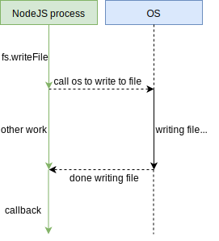
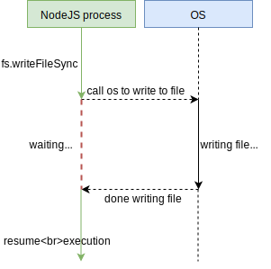
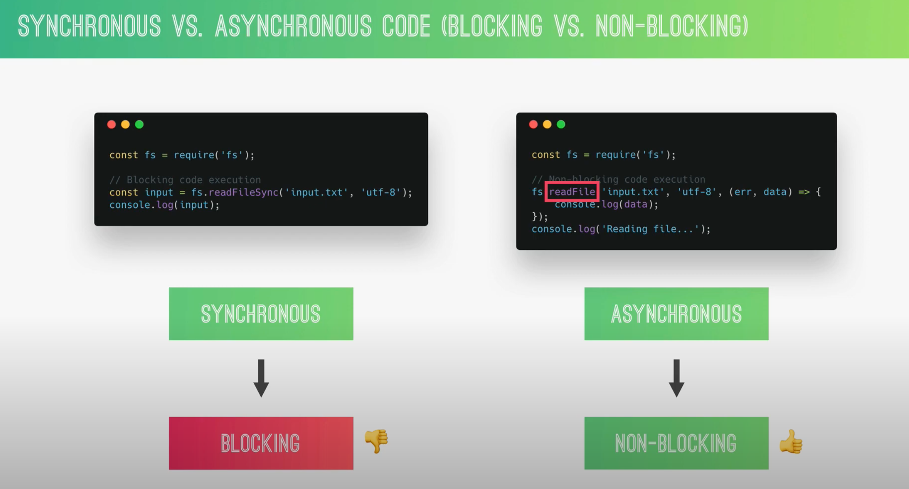

# fs - File system

## Asynchronous and Synchronous File System APIs

mô hình `bất đồng bộ (Async)`:

trong quá trình thực hiện I/O operator chương trình vẫn xử lý các task khác



mô hình `đồng bộ (Sync)`:

trong quá trình thực hiện I/O operator hay network, ... các task sẽ thực hiện lần lượt hết task này thì task khác mới
được thực hiện. Giống như xếp hàng mua vé vậy.





## Read file

### read normal

#### synchronous read

```js
var fs = require('fs')

var data;

try {
  /*                             |               |
                                 ⌄               ⌄
  */                            path           encoding
  data = fs.readFileSync('./fileForRead.txt', 'utf-8')
  console.log('data: ' + data)
} catch(err) {
  console.error("error: " + err.message)
}

```

#### asynchronous read

```js
var fs = require("fs");

fs.readFile("/fileForRead.txt", "utf-8", function (err, data) {
  if (err) {
    return console.error("error: " + err.message);
  }
  console.log("data: " + data);
});
```
