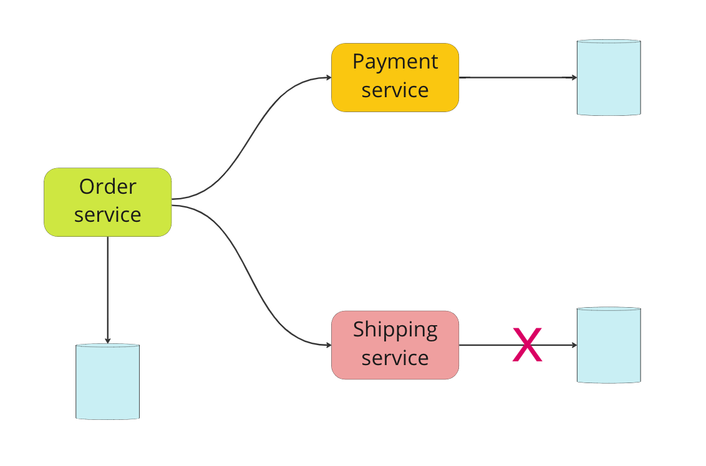

# Resiliency

# Resiliency pattern

It is possible to have network failures in a distributed system environment, and this can cause a malfunction in a specific service. For example, if Shipping Service cannot access its database due to network failure, it can be out of order after some time which will affect Order Service at the end, since Order Service uses Shipping Service to ship orders after successful payment. If there is no proper resiliency pattern for the inter-service communication, it can cause a cascading failure where Order Service also becomes unreachable even though it should be able to handle other types of requests that do not depend on Shipping Service. With a proper resiliency pattern, we would timeout shipping operation or apply some logic to retry pattern to fail fast shipping operation for now to retry that in the future once Shipping Service is back.


there is a complete network failure where Shipping Service cannot access the database, but it might be also a partial failure where network is okay, but this time there is a latency between service and database that breaches the SLA (https://en.wikipedia.org/wiki/Service- level_agreement). Assume that you have 50 ms of average latency limit for your inter-service communication, and sometimes it exceeds this limit. You can apply resiliency patterns to this use case where once the average request latency exceeds the limit, you halt sending request for a while, and resume sending requests after a specific time. By doing this, we would prevent memory leaks by dropping long lived connections to other services which can cause a possible cascading failure. Now that we see a very common example for failure in a microservice environment, let’s take a look how we can recover from this state by using some patterns like `timeout`, `retry`, `circuit breaker` to make communication more resilient.

## Timeout Pattern

trong microservice pattern, ta có nhiều services và chúng cùng nhau xử lý một task trong đó mỗi service áp dụng business logic của chúng để hoàn thành task đó. Ví vụ, `order service` phụ thuộc voà `payment service` để charge (thanh toán) cho order của họ, và `order service` cũng phụ thuộc vào `shipping service` để giao hành cho khách hàng sau khi thanh toán thành công để đánh dấu là thành công task. Các real-time service dependencies như thế này có thể dẫn đến tắc nghẽn thậm chí có thể tệ hơn, `single ò failures in a microservices architecture`. Nếu có độ trễ (latency) với `payment service` hoặc `shipping service` rõ dàng điều có có thể ảnh hưởng đến `order serivce` và trở lên rất chậm. Nếu ta có cam kết con số về `latency` (latency number) thì ta cần xem xét lại `logic of network communication` cho các service để apply `timeout pattern` thay vì phải vi phạm latency commitment. 


## Retry pattern 
Lỗi tạm thời (transient faults) xảy ra khi có sự mất tạm thời chức năng dịch vụ thường tự sửa chữa. `Retry pattern` trong gRPC cho phép chúng ta tự động thử lại một cuộc gọi không thành công. `Retry pattern` đặc biệt tốt cho các lỗi tạm thời như:

- Instant network failures ( Lỗi mạng ngay lập tức)
- Temporarily unavailable service (Services tạm thời không khả dụng)
- Resource exhaustion of a service due to load (Cạn kiện tài nguyên của service do tải [load])

grpc có một interceptor mechanism [retry](https://github.com/grpc-ecosystem/go-grpc-middleware/tree/master/retry)
```go

package main

import (
	"context"
	grpc_retry "github.com/grpc-ecosystem/go-grpc-middleware/retry"
	"google.golang.org/grpc"
	"google.golang.org/grpc/codes"
	shipping "shipping"
	"log"
	"time"
)

func main() {
	var opts []grpc.DialOption
	opts = append(opts, grpc.WithUnaryInterceptor(grpc_retry.UnaryClientInterceptor(
		grpc_retry.WithCodes(codes.Unavailable, codes.ResourceExhausted),
		grpc_retry.WithMax(5),
		grpc_retry.WithBackoff(grpc_retry.BackoffLinear(time.Second)),
	)))
	opts = append(opts, grpc.WithInsecure())
	conn, err := grpc.Dial("localhost:8080", opts...)
	if err != nil {
		log.Fatalf("Failed to connect shipping service. Err: %v", err)
	}

	defer conn.Close()

	shippingServiceClient := shipping.NewShippingServiceClient(conn)
	log.Println("Creating shipping...")
	_, errCreate := shippingServiceClient.Create(context.Background(), &shipping.CreateShippingRequest{
		UserId:  23,
		OrderId: 2344,
	})
	if errCreate != nil {
		log.Printf("Failed to create shipping. Err: %v", errCreate)
	} else {
		log.Println("Shipping is created successfully.")
	}
}
```
- `WithCodes` chỉ đơn giản là để quyết định thời điểm thử lại và default value của nó là list of `Unavailable`và `ResourceExhausted`. Unavailable code là mã mặc định vì việc thử lại cho đến khi dịch vụ khả dụng sẽ có lợi cho khách hàng trong việc khôi phục lệnh gọi gRPC sau khi dịch vụ phụ thuộc availiable. Theo cách tương tự, ResourceExhausted là một trong những giá trị mặc định vì client có thể đã thực hiện nhiều cuộc gọi theo cách mà server đã áp dụng điều tiết (`throttling`) đối với các cuộc gọi của client. Đối với loại trường hợp này, server sẽ loại bỏ điều tiết và client sẽ thành công trong các cuộc gọi tiếp theo được thực hiện bằng cách thử lại. Tóm lại, với các giá trị mặc định đó, retry sẽ chỉ được áp dụng nếu bạn nhận được thông báo Không khả dụng hoặc Đã hết tài nguyên từ cuộc gọi dịch vụ.


- `WithMax` giúp chúng ta đặt giới hạn tối đa để thử lại trong quá trình services commmnication. Nếu dependent service available sớm hơn, thì client sẽ không thử lại cho đến khi đạt số lượng tối đa, service này sẽ dừng khi client bắt đầu nhận được response code là `Unavailable` hoặc `ResourceExhausted`.

- `WithBackoff` yêu cầu một function để back-off functionality giữa các lần thử lại. Trong ví dụ của chúng ta, `BackoffLinear` được sử dụng, nghĩa là có thời gian chờ 1 giây giữa các lần thử lại. Có các tùy chọn khác như `BackoffExponential`, trong đó khoảng thời gian chờ trong lần thử lại tiếp theo được nhân với 2, so với khoảng thời gian chờ hiện tại. Một số khác là `BackoffLinearWithJitter` và `BackoffExponentialWithJitter` trong đó khoảng thời gian chờ tiếp theo được quyết định ngẫu nhiên. Tính ngẫu nhiên này làm giảm xung đột của các cuộc gọi gRPC do client thực hiện. You can refer [here](https://aws.amazon.com/blogs/architecture/exponential-backoff-and-jitter/) for the details of backoff strategies.

Như chúng ta đã nói, `retry` tốt để khắc phục các lỗi tạm thời, nhưng nếu chúng ta không biết sự cố sẽ kéo dài bao lâu, thì cuối cùng chúng ta có thể đặt tải cao cho các dependent services với các lần thử lại vô hạn. Chúng ta hãy xem một phiên bản thử lại thông minh hơn có thể phá vỡ hoàn toàn kết nối, được gọi là `Circuit Breaker Pattern`.

## Circuit Breaker Pattern

- `MaxRequests` limits the number of requests allowed to past through a half-open circuit. The difference between open and half-open circuit is half-open allows a certain number of requests to pass through the circuit based on your configuration, whereas you can’t pass through an open request.

- `Interval` is mostly used to define when the count will be cleared while the state is closed. For some use-cases, you may not want to clear the interval even it has been long time since you last saw a failure. However, for most of the use-cases, this interval is cleared to allow users to make failures within a reasonable time interval.

- `Timeout` is used to decide when to change a circuit breaker state from open to half-open state. The advantage of this change is, in open state, the requests will be failed fast whereas in half open, the circuit breaker allows passing through a half-open circuit by limiting the number of requests.

- `ReadyToTrip` helps us to check what is the state of failure threshold after last failure and decide on opening or not opening circuit completely.

- `OnStateChange` is mostly used for tracking the state changes while handling business models within a function wrapper.

Now that we’ve had a very basic explanation of the configurations of a circuit breaker, let’s design a client server communication by using circuit breaker pattern with following characteristics.
- `Maxallowedfailure` (`failed_request_count` / `total_request_count`) `ratio` is `0.6`

- `MaxRequests` allowed during `half-open` state is 3

- `Timeout` value needed for state transition from open to half-open is `4` seconds
Print a log statement whenever the state changes
